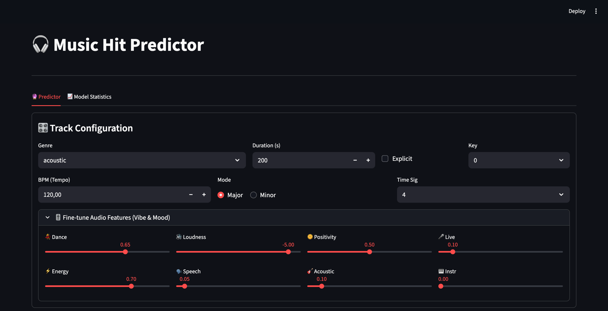
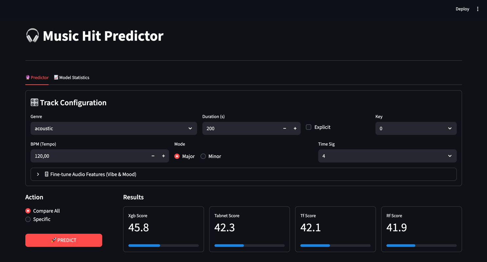
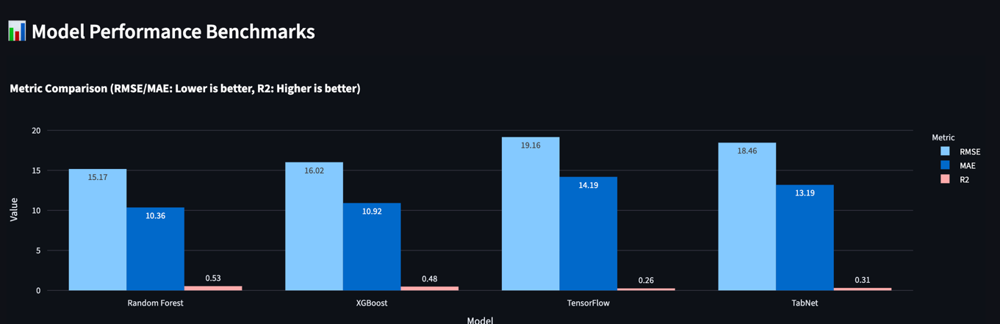
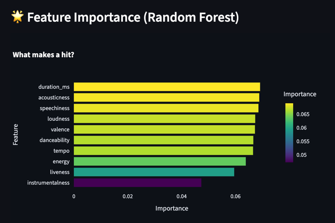

# IML_Music_Spotify_Project
Project for IML subject in PJAIT

This project implements a Machine Learning pipeline to predict the popularity of Spotify tracks based on their audio features (acousticness, danceability, energy, etc.). It features Backend API serving multiple trained models and Frontend dashboard for interactive predictions and analysis.

## 📋 Table of Contents
- [Project Overview](#project-overview)
- [Project Demonstration](#project-demonstration)
- [Dataset](#dataset)
- [Usage](#usage)
- [Model Results](#model-results)
  - [Benchmarks](#benchmarks)
  - [Random Forest](#random-forest-results)
  - [Tensorflow Model](#tensorflow-model)
  - [XGBoost](#xgboost)
  - [TabNet Model](#tabnet-model)
- [Known Issues & Fixes](#bug-in-tabnet_keras-tensorflow-library)

---

## Project Overview

The goal of this application is to determine if a song has the potential to be a "hit" (popularity score) based on its metadata. 

**Key Features:**
- **Multiple Models:** Comparison between Random Forest, XGBoost, TensorFlow (MLP), and TabNet.
- **Backend:** FastAPI service that loads pre-trained models and handles prediction requests.
- **Frontend:** Streamlit application allowing users to tweak audio parameters (Mood, Vibe) and see real-time predictions.
- **Analysis:** Visualizations of feature importance and model performance comparisons.

---

## Project Demonstration

Here is how the application looks and functions:

### 1. Interactive Prediction Dashboard
Users can fine-tune specific audio features (like Danceability, Energy, Loudness) to see how they affect the predicted popularity score across different models.



### 2. Prediction Results
Comparison of prediction scores from all trained models for the given input.



---

## Dataset
The models were trained using the **Spotify Tracks Dataset** available on Kaggle:
[Link to Spotify Track Dataset](https://www.kaggle.com/datasets/maharshipandya/-spotify-tracks-dataset/data)

---

### Usage
- Python 3.10+

### 1. Run the Backend
Navigate to the `backend` directory and start the FastAPI server:
```bash
cd backend
uvicorn main:app --reload

```

The API will be available at `http://127.0.0.1:8000`.

### 2. Run the Frontend

Open a new terminal, navigate to the `frontend` directory and start Streamlit:

```bash
cd frontend
streamlit run app.py

```

The interface will open in your browser at `http://localhost:8501`.

---

## Model Results

We evaluated four different architectures. Below are the visual benchmarks and detailed statistics.




### Benchmarks

Overview of RMSE, MAE, and R2 scores across all models, and Feature Importance analysis.

### Random Forest Results
```
============================================================
                   HYPERPARAMETER TUNING                    
============================================================
Best Parameters: 
- n_estimators: 300
- min_samples_split: 2
- min_samples_leaf: 2
- max_features: None
- max_depth: None

============================================================
                        TEST RESULTS                        
============================================================
- RMSE (Root Mean Sq. Error):    15.1706
- MAE  (Mean Absolute Error):    10.3634
- R2   (R-Squared Score):         0.5336

============================================================
                 TOP 10 FEATURE IMPORTANCE                  
============================================================
duration_ms          | ██                             0.0691
acousticness         | ██                             0.0688
speechiness          | ██                             0.0685
loudness             | ██                             0.0673
valence              | ██                             0.0672
danceability         | █                              0.0666
tempo                | █                              0.0665
energy               | █                              0.0638
liveness             | █                              0.0595
instrumentalness     | █                              0.0473
```

### Random Forest Results After Sample Weighting
```
============================================================
                   HYPERPARAMETER TUNING                    
============================================================
Best Parameters: 
- n_estimators: 500
- min_samples_split: 10
- min_samples_leaf: 4
- max_features: log2
- max_depth: None

============================================================
                        TEST RESULTS                        
============================================================
- RMSE (Root Mean Sq. Error):    20.9008
- MAE  (Mean Absolute Error):    15.7033
- R2   (R-Squared Score):         0.1148

============================================================
                 TOP 10 FEATURE IMPORTANCE                  
============================================================
instrumentalness     | ███                            0.1046
loudness             | █                              0.0659
duration_ms          | █                              0.0638
danceability         | █                              0.0619
acousticness         | █                              0.0575
energy               | █                              0.0569
valence              | █                              0.0488
genre_pop            | █                              0.0468
speechiness          | █                              0.0445
tempo                | █                              0.0418
```

### Tensorflow Model
```
============================================================
               BEST HYPERPARAMETERS DETAILED                
============================================================
Learning Rate:     0.0005
Num Layers:        2.0000

	[Layer 1 INFORMATION]
Units:              64.0000
Dropout Enabled:     0.0000
Batch Norm:          1.0000

	[Layer 2 INFORMATION]
Units:              96.0000
Dropout Enabled:     1.0000
Dropout Rate:        0.1000
Batch Norm:          1.0000

============================================================
                        TEST RESULTS                        
============================================================
- RMSE (Root Mean Sq. Error):    19.1617
- MAE  (Mean Absolute Error):    14.1879
- R2   (R-Squared Score):         0.2560
```

### Tensorflow Model After Stratified Sampling
```
============================================================
               BEST HYPERPARAMETERS DETAILED                
============================================================
Learning Rate:     0.0005
Num Layers:        1.0000

	[Layer 1 INFORMATION]
Units:              96.0000
Dropout Enabled:     1.0000
Dropout Rate:        0.2000
Batch Norm:          1.0000

============================================================
                        TEST RESULTS                        
============================================================
644/644 ━━━━━━━━━━━━━━━━━━━━ 1s 1ms/step
- RMSE (Root Mean Sq. Error):    17.0331
- MAE  (Mean Absolute Error):    12.2528
- R2   (R-Squared Score):         0.3076
```

### XGBoost
```
============================================================
                    BEST HYPERPARAMETERS                    
============================================================
- n_estimators: 999 
- max_depth: 9 
- learning_rate: 0.11556007659389379
- subsample: 0.9810541206272365 
- colsample_bytree: 0.8568252553587502

============================================================
                        TEST RESULTS                        
============================================================
- RMSE (Root Mean Sq. Error):    15.6779
- MAE  (Mean Absolute Error):    10.4751
- R2   (R-Squared Score):         0.5019
```

### XGBoost After Sample Weighting
```
============================================================
                    BEST HYPERPARAMETERS                    
============================================================
- n_estimators: 999 
- max_depth: 10 
- learning_rate: 0.2941035559166622
- subsample: 0.9997921072409696
- colsample_bytree: 0.7933905890703496

============================================================
                        TEST RESULTS                        
============================================================
- RMSE (Root Mean Sq. Error):    16.0190
- MAE  (Mean Absolute Error):    10.9180
- R2   (R-Squared Score):         0.4800
```

### Tabnet model
```
============================================================
                        TEST RESULTS                        
============================================================
- RMSE (Root Mean Sq. Error):    18.3855
- MAE  (Mean Absolute Error):    13.2294
- R2   (R-Squared Score):         0.3150

{
    "decision_dim": 64,
    "attention_dim": 64,
    "n_steps": 8,
    "n_shared_glus": 2,
    "n_dependent_glus": 2,
    "relaxation_factor": 1.5,
    "epsilon": 1e-15,
    "momentum": 0.98,
    "mask_type": "softmax",
    "lambda_sparse": 1e-4,
    "batch_size": 512,
    "epochs": 150
}
```

### Tabnet Model After Stratified Sampling
```
============================================================
                        TEST RESULTS                        
============================================================
- RMSE (Root Mean Sq. Error):    16.6083
- MAE  (Mean Absolute Error):    11.6408
- R2   (R-Squared Score):         0.3417
```
---

# Bug in TabNet_keras tensorflow library
- W ```.../lib/python3.10/site-packages/tabnet_keras/feature_transformer.py```  jakiegoś dziwnego powodu nie działa poprawnie wyliczenie pierwiastka kwadratowego z liczby 0.5
- Rozwiązanie: trzeba zamienić ```self.norm_factor = tf.math.sqrt(tf.constant(0.5))``` na ```self.norm_factor = math.sqrt(0.5)```
